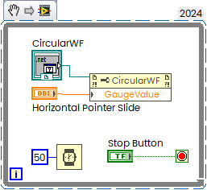
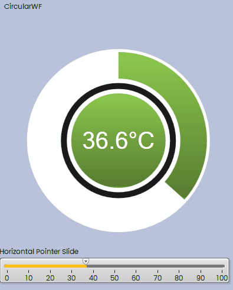

# CircularWPF

Simple example — how to use WPF Control in LabVIEW.

Result:

Base WPF Code was taken from [Code Samples](https://crudzone.wordpress.com/wpf/).

Project is dependent on two packages from nuget:

"Expression.Blend.Sdk.WPF" version="1.0.1"
"Microsoft.SDK.Expression.Blend" version="1.0.0"
Target framework  is "net48".
LabVIEW Code saved in  2018.

### Troubleshooting

If you see the following message:

Then probably you open Circular.vi without project like "stand alone". Try to open Circular.lvproj file first,m then open VI from the project:

